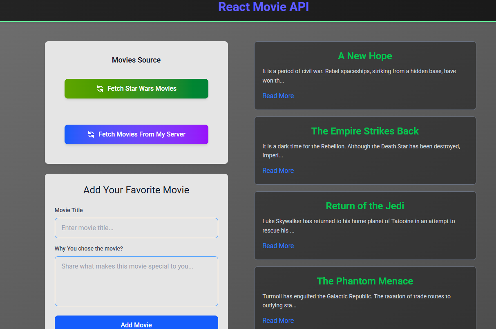

<div align="center">

<p>
  
  
  
  
  
  <a href="https://fetch-movie-app.vercel.app" target="_blank" rel="noopener noreferrer">
    
  </a>
</p>

</div>

# Fetch Movie App

[Live Demo](https://fetch-movie-nine.vercel.app/) | [GitHub Repository](https://github.com/viboverse/fetch-movie)

A modern React application for fetching and managing movies, built with React, Vite, and Tailwind CSS. Powered by Vercel for seamless deployment.

## Technologies Used

- **React**: 19.1.0 - A JavaScript library for building user interfaces
- **Tailwind CSS**: 4.1.12 - Utility-first CSS framework
- **Vite**: 7.0.0 - Fast build tool and development server
- **ESLint**: 9.29.0 - Linting utility for JavaScript and JSX
- **Prettier**: 3.6.2 - Code formatter
- **Node.js**: 18.18.0 - JavaScript runtime
- **npm**: 9.0.0 - Package manager

## Features

- **Fetch Star Wars Movies**: Retrieve and display movies from the Star Wars API
- **Add Custom Movies**: Allow users to add their own movies with validation
- **Responsive Design**: Modern UI built with Tailwind CSS
- **Component-Based Architecture**: Reusable React components
- **Fast Development**: Powered by Vite for quick builds and hot reloading

## Installation Instructions

1. Clone the repository:

   ```sh
   git clone https://github.com/viboverse/fetch-movie.git
   ```

2. Navigate to the project directory:

   ```sh
   cd fetch-movie
   ```

3. Install dependencies:

   ```sh
   npm install
   ```

4. Start the development server:

   ```sh
   npm run dev
   ```

5. Open `http://localhost:5173` in your browser to view the app.

## Screenshot



---

**Built by [Vahab Afsharian](https://github.com/viboverse)**
